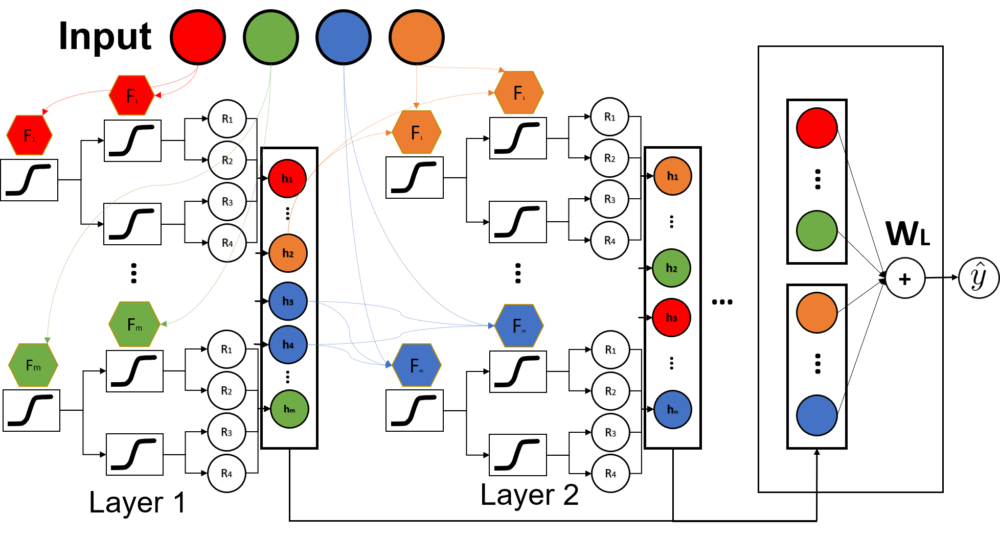

# NODE GAM: Differentiable Generalized Additive Model for Interpretable Deep Learning: 

This repository is the official implementation of [NODE GAM: Differentiable Generalized Additive Model for Interpretable Deep Learning](). 



## Requirements

To install requirements:

```setup
pip install -r requirements.txt
```


## Training

Please see `bikeshare_node_ga2m.ipynb`. This is a simplified notebook for how to train and visualize a NODE-GA2M on Bikeshare.

We provide the hyperparmeters we use in `best_hparams/`.  
To reproduce our results, e.g. NODE-GA2M trained in fold 0 (total 5 folds) of bikeshare, you can run 

```train
python main.py --name 0603_best_bikeshare_f0 --load_from_hparams best_hparams/node_ga2m/0519_f0_best_bikeshare_GAM_ga2m_s83_nl4_nt125_td1_d6_od0.0_ld0.3_cs0.5_lr0.01_lo0_la0.0_pt0_pr0_mn0_ol0_ll1 --fold 0
```

The models will be stored in `logs/0603_best_bikeshare_f0/`. And the results including test/val error are stored in `results/bikeshare_GAM_new10.csv`

## Visualization

To visualize the model, run this in a notebook:

```eval
from lib.vis_utils import vis_main_effects

tmp = {
    'node_ga2m': lib.average_GAMs([
        '0603_best_bikeshare_f0',
    ], max_n_bins=256),
}

fig, ax = vis_main_effects(tmp)
```

See bikeshare visualization.ipynb which we provide all graphs for all models (NODE-GA2M, NODE-GAM, EBM and Spline) in our paper, and you can see files in `best_dfs/`.

## Results

See the Table 1 and 2 of our paper. We show our NODE-GAM and NODE-GA2M is competitive with other GAMs including EBM and Spline.


## Contributing

All content in this repository is licensed under the MIT license.
