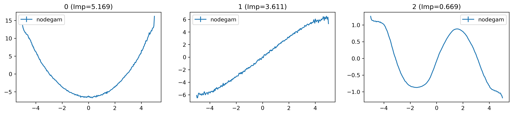
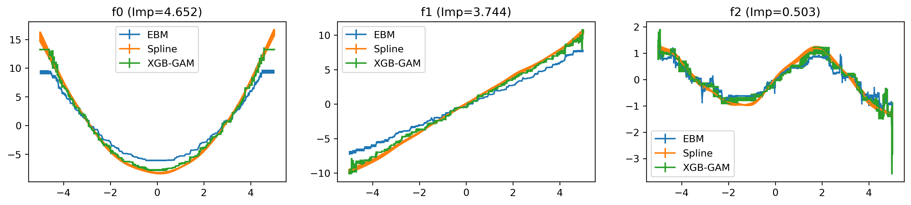

.. NodeGAM documentation master file, created by
   sphinx-quickstart on Mon Jul  4 10:26:28 2022.
   You can adapt this file completely to your liking, but it should at least
   contain the root `toctree` directive.

Welcome to NodeGAM's documentation!
===================================

NodeGAM is an interpretable deep learning GAM model proposed in our ICLR 2022 paper:
`NODE GAM: Differentiable Generalized Additive Model for Interpretable Deep Learning <https://arxiv.org/abs/2106.01613>`_.
In short, it trains a GAM model by multi-layer differentiable trees to be accurate, interpretable, and
differentiable. See this `blog post <https://medium.com/@chkchang21/interpretable-deep-learning-models-for-tabular-data-neural-gams-500c6ecc0122>`_
for an intro, and the `repo <https://github.com/zzzace2000/nodegam>`_ for reproducing the paper or
custom adaptation to your needs.

.. image:: ../../resources/images/Fig1.png

Installation
------------

.. code-block:: bash

   pip install nodegam

The performance and the runtime of the NodeGAM package
------------------------------------------------------

We compare NodeGAM with other GAMs (EBM, XGB-GAM), and XGB in 6 datasets.
All models use default parameters, so the performance of NodeGAM here is lower than what paper
reported. We find NodeGAM often performs better in larger datasets.

3 classification datasets:

.. list-table::
   :header-rows: 1

   * - Dataset/AUROC
     - Domain
     - N
     - P
     - NodeGAM
     - EBM
     - XGB-GAM
     - XGB
   * - MIMIC-II
     - Medicine
     - 25K
     - 17
     - 0.844 ± 0.018
     - 0.842 ± 0.019
     - 0.833 ± 0.02
     - **0.845 ± 0.019**
   * - Adult
     - Finance
     - 33K
     - 14
     - 0.916 ± 0.002
     - **0.927 ± 0.003**
     - 0.925 ± 0.002
     - **0.927 ± 0.002**
   * - Credit
     - Finance
     - 285K
     - 30
     - **0.989 ± 0.008**
     - 0.984 ± 0.007
     - 0.985 ± 0.008
     - 0.984 ± 0.01

3 regression datasets:

.. list-table::
   :header-rows: 1

   * - Dataset/RMSE
     - Domain
     - N
     - P
     - NodeGAM
     - EBM
     - XGB-GAM
     - XGB
   * - Wine
     - Nature
     - 5K
     - 12
     - 0.705 ± 0.012
     - 0.69 ± 0.011
     - 0.713 ± 0.006
     - **0.682 ± 0.023**
   * - Bikeshare
     - Retail
     - 17K
     - 16
     - 57.438 ± 3.899
     - 55.676 ± 0.327
     - 101.093 ± 0.946
     - **45.212 ± 1.254**
   * - Year
     - Music
     - 515K
     - 90
     - **9.013 ± 0.004**
     - 9.204 ± 0.0
     - 9.257 ± 0.0
     - 9.049 ± 0.0

We also find the run time of our model increases mildly with growing data size due to mini-batch
training, while our baselines increase training time much more.

3 classification datasets:

.. list-table::
   :header-rows: 1

   * - Dataset/Seconds
     - Domain
     - N
     - P
     - NodeGAM
     - EBM
     - XGB-GAM
     - XGB
   * - MIMIC-II
     - Medicine
     - 25K
     - 17
     - 105.0 ± 14.0
     - 6.0 ± 2.0
     - **0.0 ± 1.0**
     - 1.0 ± 1.0
   * - Adult
     - Finance
     - 33K
     - 14
     - 196.0 ± 56.0
     - 15.0 ± 8.0
     - 6.0 ± 0.0
     - **1.0 ± 0.0**
   * - Credit
     - Finance
     - 285K
     - 30
     - 113.0 ± 36.0
     - 37.0 ± 2.0
     - 26.0 ± 7.0
     - **16.0 ± 2.0**

3 regression datasets:

.. list-table::
   :header-rows: 1

   * - Dataset/Seconds
     - Domain
     - N
     - P
     - NodeGAM
     - EBM
     - XGB-GAM
     - XGB
   * - Wine
     - Nature
     - 5K
     - 12
     - 157.0 ± 86.0
     - 4.0 ± 2.0
     - **0.0 ± 0.0**
     - **0.0 ± 0.0**
   * - Bikeshare
     - Retail
     - 17K
     - 16
     - 223.0 ± 23.0
     - 15.0 ± 3.0
     - **1.0 ± 1.0**
     - 2.0 ± 1.0
   * - Year
     - Music
     - 515K
     - 90
     - **318.0 ± 20.0**
     - 501.0 ± 8.0
     - 376.0 ± 1.0
     - 537.0 ± 1.0

Reproducing notebook is `here <https://nbviewer.jupyter.org/github/zzzace2000/nodegam/blob/main/notebooks/benchmark%20speed%20and%20acc%20of%20the%20package.ipynb>`_.

See the Table 1 and 2 of our `paper <https://arxiv.org/abs/2106.01613>`_ for more comparisons.

NodeGAM Training
----------------

To simply use it on your dataset, just run:

.. code-block:: python

   from nodegam.sklearn import NodeGAMClassifier, NodeGAMRegressor

   model = NodeGAMClassifier()
   model.fit(X, y)

Understand the model:

.. code-block:: python

   model.visualize()

or

.. code-block:: python

   from nodegam.vis_utils import vis_GAM_effects

   vis_GAM_effects({
       'nodegam': model.get_GAM_df(),
   })

See the ``notebooks/toy dataset with nodegam sklearn.ipynb`` `here <https://nbviewer.jupyter.org/github/zzzace2000/nodegam/blob/main/notebooks/toy%20dataset%20with%20nodegam%20sklearn.ipynb>`_.

Other GAMs Training
--------------------

We also provide code to train other GAMs for comparisons such as:

* Spline: we use the `pygam <https://pygam.readthedocs.io/en/latest/>`_ package.
* EBM: `Explainable Boosting Machine <https://github.com/interpretml/interpret>`_.
* XGB-GAM: Limit the XGB to have tree depth 1 that removes all interaction effects in the model.
  It's proposed in `our KDD paper <https://arxiv.org/abs/2006.06466>`_.

To train baselines on your dataset, just run:

.. code-block:: python

   from nodegam.gams.MySpline import MySplineLogisticGAM, MySplineGAM
   from nodegam.gams.MyEBM import MyExplainableBoostingClassifier, MyExplainableBoostingRegressor
   from nodegam.gams.MyXGB import MyXGBOnehotClassifier, MyXGBOnehotRegressor
   from nodegam.gams.MyBagging import MyBaggingClassifier, MyBaggingRegressor

   ebm = MyExplainableBoostingClassifier()
   ebm.fit(X, y)

   spline = MySplineLogisticGAM()
   bagged_spline = MyBaggingClassifier(base_estimator=spline, n_estimators=3)
   bagged_spline.fit(X, y)

   xgb_gam = MyXGBOnehotClassifier()
   bagged_xgb = MyBaggingClassifier(base_estimator=xgb_gam, n_estimators=3)
   bagged_xgb.fit(X, y)

Understand the models:

.. code-block:: python

   from nodegam.vis_utils import vis_GAM_effects

   fig, ax = vis_GAM_effects(
       all_dfs={
           'EBM': ebm.get_GAM_df(),
           'Spline': bagged_spline.get_GAM_df(),
           'XGB-GAM': bagged_xgb.get_GAM_df(),
       },
   )

See the ``notebooks/toy dataset with nodegam sklearn.ipynb`` `here <https://nbviewer.jupyter.org/github/zzzace2000/nodegam/blob/main/notebooks/toy%20dataset%20with%20nodegam%20sklearn.ipynb>`_ for an example.

Citations
---------

If you find the code useful, please cite:

.. code-block::

   @inproceedings{chang2021node,
     title={NODE-GAM: Neural Generalized Additive Model for Interpretable Deep Learning},
     author={Chang, Chun-Hao and Caruana, Rich and Goldenberg, Anna},
     booktitle={International Conference on Learning Representations},
     year={2022}
   }

   @inproceedings{chang2021interpretable,
     title={How interpretable and trustworthy are gams?},
     author={Chang, Chun-Hao and Tan, Sarah and Lengerich, Ben and Goldenberg, Anna and Caruana, Rich},
     booktitle={Proceedings of the 27th ACM SIGKDD Conference on Knowledge Discovery \& Data Mining},
     pages={95--105},
     year={2021}
   }

Contributing
------------

All content in this repository is licensed under the MIT license.

.. toctree::
   :maxdepth: 2
   :caption: Contents:

   notebooks/quick_start
   notebooks/nodegam_sklearn
   notebooks/bikeshare_node_ga2m
   user_api
   modules

..
   Indices and tables
   ==================

   * :ref:`genindex`
   * :ref:`modindex`
   * :ref:`search`
